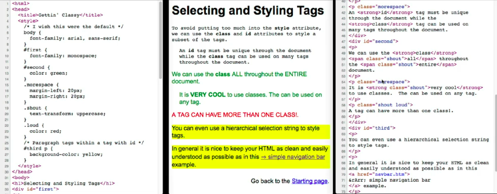

# Structure of an HTML Document

```html

<!DOCTYPE html>
<html>
	<head>
		Metadata about the page
	</head>
	
	<body>
		Displayable content of the page
	</body>

</html>
```

Click to the links bellow to learn more about **HTML tags**:
- [HTML cheatsheet](https://htmlcheatsheet.com/)
- [wa4e website](https://www.wa4e.com/lessons)

To check HMTL syntax: [Nu Html Checker](https://validator.w3.org/nu/)

# An overview of CSS

CSS is a set of "rules" which in include a "*selector*" and one or more "*properties*" and "*values*" as well as some punctuation.

For example:

```
body {                                  <--+
      font-family: arial, sans-serif;      | selector
}                                       <--+ 
            ^             ^
            |             |
        property       values
```

# Applying CSS to our HTML

 - **Inline** right on an HTML tag, using the *style = attribute*

```html
 <p style=" border-style: solid; boder-color: red; border-width: 5px;" == $0
	we can put a border around a block of txt
 </p>
```
  We can also use *span* or *div* tag for text design if do not want to use *style* attribute.

 - An **embedded style sheet** in the *<head>* of the document

```html
<head>
	<title> Title </title>
	<style>
		body {
			font-family: arial, sans-serif;
		}
		p {
			color: blue;
		}
		a {
			color:green;
			background-color: lightgray;
		}
	<style>
</head>
```

 - As an **external style sheet** in a separate file

```html
<head>
	<title> Title </title>
	<link type="text/css" rel="stylesheet" href="rules.css"
</head>
```
In the `rules.css` file:

```css
body {
	font-family: arial, sans-serif;
}
p {
	color: blue;
}
a {
	color:green;
	background-color: lightgray;
}     
```

**Examples of using id and class in CSS**



